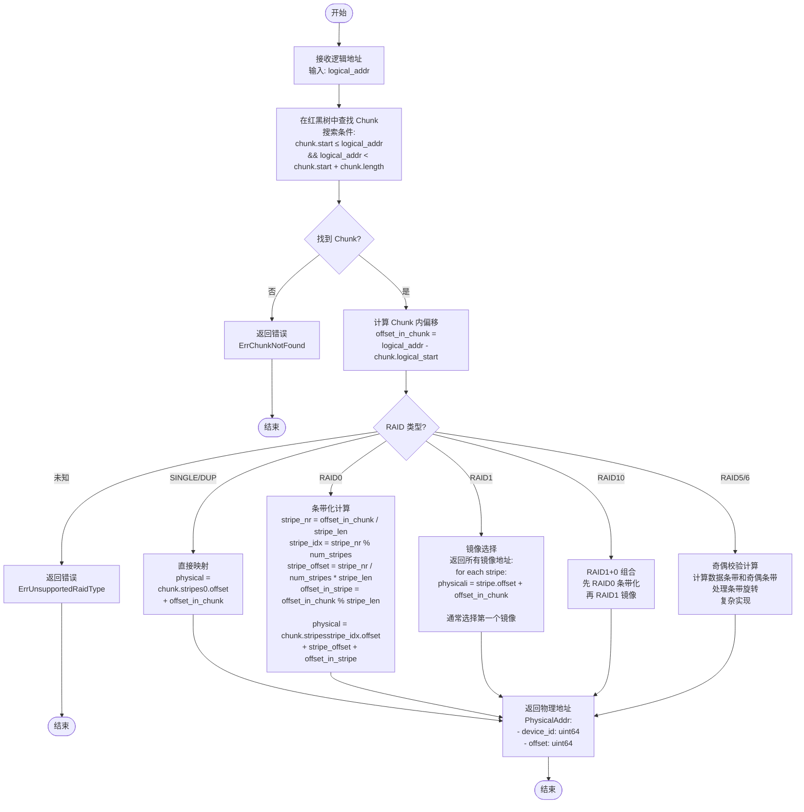

# 逻辑地址到物理地址映射流程

## RAID 类型说明

| RAID 类型 | 特点 |
|-----------|------|
| SINGLE | 单设备，无冗余 |
| DUP | 同设备双份 (元数据) |
| RAID0 | 条带化，提高性能 |
| RAID1 | 镜像，提高可靠性 |
| RAID10 | RAID1+0 组合 |
| RAID5 | 单奇偶校验 |
| RAID6 | 双奇偶校验 |
