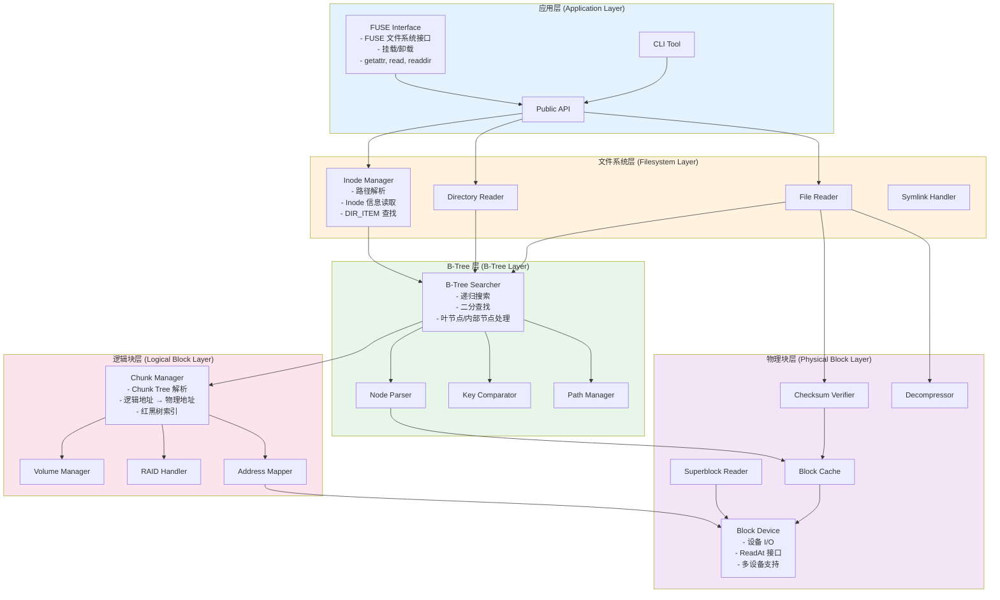

# Btrfs 文件系统读取服务 - 分层架构

```mermaid
graph TB
    subgraph Application["应用层 (Application Layer)"]
        FUSE[FUSE Interface<br/>- FUSE 文件系统接口<br/>- 挂载/卸载<br/>- getattr, read, readdir]
        CLI[CLI Tool]
        API[Public API]
    end
    
    subgraph Filesystem["文件系统层 (Filesystem Layer)"]
        Inode[Inode Manager<br/>- 路径解析<br/>- Inode 信息读取<br/>- DIR_ITEM 查找]
        Dir[Directory Reader]
        File[File Reader]
        Symlink[Symlink Handler]
    end
    
    subgraph BTree["B-Tree 层 (B-Tree Layer)"]
        BTreeSearch[B-Tree Searcher<br/>- 递归搜索<br/>- 二分查找<br/>- 叶节点/内部节点处理]
        NodeParser[Node Parser]
        KeyComp[Key Comparator]
        PathMgr[Path Manager]
    end
    
    subgraph Logical["逻辑块层 (Logical Block Layer)"]
        ChunkMgr[Chunk Manager<br/>- Chunk Tree 解析<br/>- 逻辑地址 → 物理地址<br/>- 红黑树索引]
        VolMgr[Volume Manager]
        RAID[RAID Handler]
        AddrMap[Address Mapper]
    end
    
    subgraph Physical["物理块层 (Physical Block Layer)"]
        BlockDev[Block Device<br/>- 设备 I/O<br/>- ReadAt 接口<br/>- 多设备支持]
        Super[Superblock Reader]
        Cache[Block Cache]
        Checksum[Checksum Verifier]
        Decompress[Decompressor]
    end
    
    %% 应用层依赖关系
    FUSE --> API
    CLI --> API
    API --> Inode
    API --> Dir
    API --> File
    
    %% 文件系统层依赖关系
    Inode --> BTreeSearch
    Dir --> BTreeSearch
    File --> BTreeSearch
    File --> Decompress
    File --> Checksum
    
    %% B-Tree 层依赖关系
    BTreeSearch --> NodeParser
    BTreeSearch --> KeyComp
    BTreeSearch --> PathMgr
    BTreeSearch --> ChunkMgr
    NodeParser --> Cache
    
    %% 逻辑层依赖关系
    ChunkMgr --> VolMgr
    ChunkMgr --> RAID
    ChunkMgr --> AddrMap
    AddrMap --> BlockDev
    
    %% 物理层依赖关系
    Super --> BlockDev
    Cache --> BlockDev
    Checksum --> Cache
    
    style Application fill:#E3F2FD
    style Filesystem fill:#FFF3E0
    style BTree fill:#E8F5E9
    style Logical fill:#FCE4EC
    style Physical fill:#F3E5F5
```

## 层次说明

| 层次 | 职责 |
|------|------|
| 应用层 | 提供用户接口 (FUSE/CLI/API) |
| 文件系统层 | 文件和目录操作 |
| B-Tree 层 | 元数据索引和搜索 |
| 逻辑块层 | 地址映射和 RAID 处理 |
| 物理块层 | 设备 I/O 和缓存 |
