# Complete File Read Flow

```mermaid
sequenceDiagram
    actor User
    participant FS as FileSystem
    participant IR as InodeReader
    participant FR as FileReader
    participant BTS as BTreeSearcher
    participant CM as ChunkManager
    participant DC as Decompressor
    participant CV as ChecksumVerifier
    participant BD as BlockDevice

    User->>FS: ReadFile("/home/user/file.txt")
    activate FS
    
    Note over FS,BD: 1. 路径解析
    FS->>IR: LookupPath("/home/user/file.txt")
    activate IR
    
    IR->>IR: 分割路径 ["home", "user", "file.txt"]
    IR->>IR: 从根目录开始 (ino=256)
    
    loop 遍历路径每个部分
        Note right of IR: key = {<br/>objectid: current_ino<br/>type: DIR_ITEM<br/>offset: hash("home")}
        IR->>BTS: Search(fsTree, DIR_ITEM key)
        activate BTS
        
        BTS->>CM: LogicalToPhysical(nodeAddr)
        activate CM
        CM->>CM: FindChunk(logical)
        CM->>CM: MapAddress(RAID0/1/...)
        CM-->>BTS: physicalAddr
        deactivate CM
        
        BTS->>BD: ReadAt(physicalAddr, nodeSize)
        activate BD
        BD-->>BTS: node_data
        deactivate BD
        
        BTS->>BTS: ParseNode()
        BTS->>BTS: BinarySearch(key)
        BTS-->>IR: DIR_ITEM (子 inode)
        deactivate BTS
        
        IR->>IR: current_ino = 子 inode
    end
    
    IR-->>FS: file_ino (最终文件的 inode)
    deactivate IR
    
    Note over FS,BD: 2. 读取 Inode 信息
    FS->>IR: ReadInode(file_ino)
    activate IR
    
    Note right of IR: key = {<br/>objectid: file_ino<br/>type: INODE_ITEM<br/>offset: 0}
    IR->>BTS: Search(fsTree, INODE_ITEM key)
    activate BTS
    
    BTS->>CM: LogicalToPhysical()
    CM-->>BTS: physicalAddr
    BTS->>BD: ReadAt()
    BD-->>BTS: node_data
    BTS->>BTS: ParseInodeItem()
    BTS-->>IR: InodeInfo (size, mode, ...)
    deactivate BTS
    
    IR-->>FS: inodeInfo
    deactivate IR
    
    Note over FS,BD: 3. 查找文件 Extent
    FS->>FR: FindExtent(file_ino, offset=0)
    activate FR
    
    Note right of FR: key = {<br/>objectid: file_ino<br/>type: EXTENT_DATA<br/>offset: 0}
    FR->>BTS: Search(fsTree, EXTENT_DATA key)
    activate BTS
    
    BTS->>CM: LogicalToPhysical()
    CM-->>BTS: physicalAddr
    BTS->>BD: ReadAt()
    BD-->>BTS: node_data
    BTS->>BTS: ParseExtentItem()
    
    alt INLINE extent
        BTS-->>FR: inline_data (数据在 item 中)
    else REGULAR extent
        Note right of BTS: ExtentInfo {<br/>disk_bytenr: 逻辑地址<br/>disk_num_bytes: 磁盘大小<br/>compression: 压缩类型<br/>offset: extent 内偏移<br/>num_bytes: 实际大小}
        BTS-->>FR: ExtentInfo
    end
    
    deactivate BTS
    
    Note over FS,BD: 4. 读取 Extent 数据
    alt INLINE extent
        FR-->>FS: inline_data
    else REGULAR extent
        FR->>CM: LogicalToPhysical(disk_bytenr)
        activate CM
        
        CM->>CM: FindChunk(disk_bytenr)
        
        alt RAID0
            CM->>CM: 计算条带索引和偏移
            CM-->>FR: physicalAddr
        else RAID1
            CM->>CM: 选择第一个镜像
            CM-->>FR: physicalAddr (mirror 0)
        else RAID5/6
            CM->>CM: 奇偶校验计算
            CM-->>FR: physicalAddr
        end
        
        deactivate CM
        
        FR->>BD: ReadAt(physicalAddr, disk_num_bytes)
        activate BD
        BD-->>FR: compressed_data
        deactivate BD
        
        FR->>CV: Verify(compressed_data, expected_csum)
        activate CV
        CV->>CV: ComputeCRC32C(data)
        CV->>CV: Compare(computed, expected)
        
        alt 校验和匹配
            CV-->>FR: OK
        else 校验和不匹配
            CV-->>FR: Error (数据损坏)
        end
        deactivate CV
        
        alt compression = ZLIB
            FR->>DC: DecompressZlib(compressed_data)
            activate DC
            DC-->>FR: decompressed_data
            deactivate DC
        else compression = LZO
            FR->>DC: DecompressLZO(compressed_data)
            activate DC
            DC-->>FR: decompressed_data
            deactivate DC
        else compression = ZSTD
            FR->>DC: DecompressZstd(compressed_data)
            activate DC
            DC-->>FR: decompressed_data
            deactivate DC
        else no compression
            FR->>FR: decompressed_data = compressed_data
        end
        
        FR-->>FS: decompressed_data
    end
    
    deactivate FR
    
    Note over FS,BD: 5. 处理跨 Extent 读取 (如果需要)
    alt 文件大小 > 单个 extent
        loop 剩余的 extents
            FS->>FR: FindExtent(file_ino, next_offset)
            FR-->>FS: next_extent_data
            FS->>FS: 拼接数据
        end
    end
    
    FS-->>User: file_data (完整文件内容)
    deactivate FS
    
    Note over User,BD: 读取完成!<br/>完整流程包括:<br/>1. 路径解析 (遍历目录树)<br/>2. 读取 Inode<br/>3. 查找 Extent<br/>4. 地址映射 (逻辑→物理)<br/>5. 读取物理数据<br/>6. 校验和验证<br/>7. 解压缩
```

## 流程说明

### 1. 路径解析
- 分割路径为各个部分
- 从根目录 (inode 256) 开始
- 遍历每个路径组件,通过 DIR_ITEM 查找子目录/文件的 inode

### 2. 读取 Inode 信息
- 通过 INODE_ITEM key 查找文件元数据
- 获取文件大小、权限、时间戳等信息

### 3. 查找文件 Extent
- 通过 EXTENT_DATA key 查找文件数据位置
- 区分 INLINE extent (数据在 B-Tree 中) 和 REGULAR extent (数据在独立块中)

### 4. 读取 Extent 数据
- 逻辑地址映射到物理地址 (通过 Chunk Manager)
- 支持多种 RAID 类型 (RAID0/1/5/6)
- 验证数据校验和
- 解压缩数据 (支持 ZLIB/LZO/ZSTD)

### 5. 处理跨 Extent 读取
- 大文件可能分散在多个 extent 中
- 循环读取所有 extent 并拼接数据
