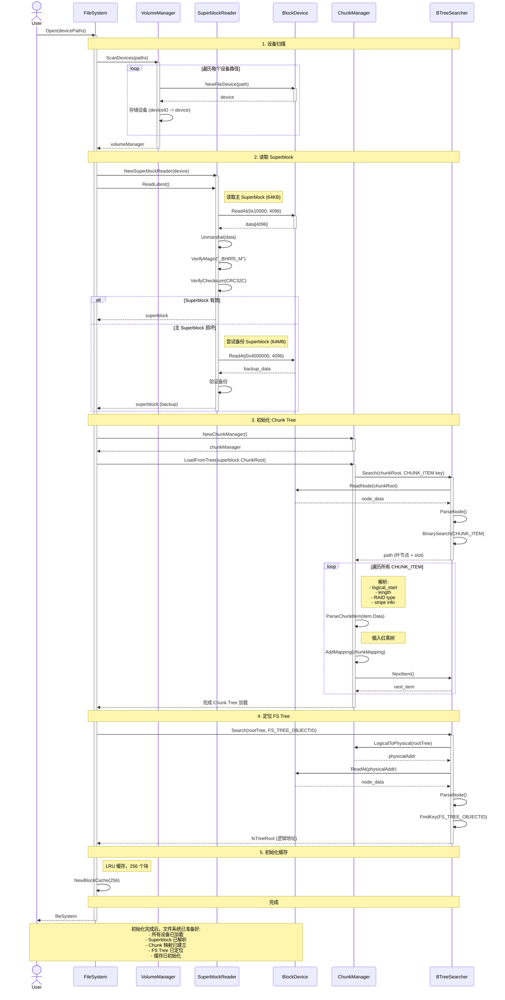

# Btrfs Filesystem Initialization

## 初始化步骤说明

### 1. 设备扫描
- 遍历所有设备路径
- 为每个设备创建 BlockDevice 实例
- 建立 deviceID 到 device 的映射

### 2. 读取 Superblock
- 主 Superblock 位于偏移 0x10000 (64KB)
- 验证魔数 "_BHRfS_M"
- 验证 CRC32C 校验和
- 如果主 Superblock 损坏,尝试读取备份 (偏移 0x4000000, 64MB)

### 3. 初始化 Chunk Tree
- 从 Superblock 获取 Chunk Tree 根节点地址
- 遍历 Chunk Tree 中的所有 CHUNK_ITEM
- 解析每个 Chunk 的映射信息:
  - logical_start: 逻辑起始地址
  - length: Chunk 长度
  - RAID type: SINGLE/DUP/RAID0/1/5/6/10
  - stripe info: 条带信息
- 将映射插入红黑树以便快速查找

### 4. 定位 FS Tree
- 在 Root Tree 中搜索 FS_TREE_OBJECTID
- 获取 FS Tree 的根节点逻辑地址
- FS Tree 包含所有文件和目录的元数据

### 5. 初始化缓存
- 创建 LRU 缓存 (256 个块)
- 减少重复的磁盘 I/O 操作
- 提高文件读取性能

## 初始化后状态

初始化完成后,文件系统处于就绪状态:
- ✅ 所有设备已加载
- ✅ Superblock 已解析
- ✅ Chunk 映射已建立 (逻辑→物理地址转换)
- ✅ FS Tree 已定位
- ✅ LRU 缓存已初始化
